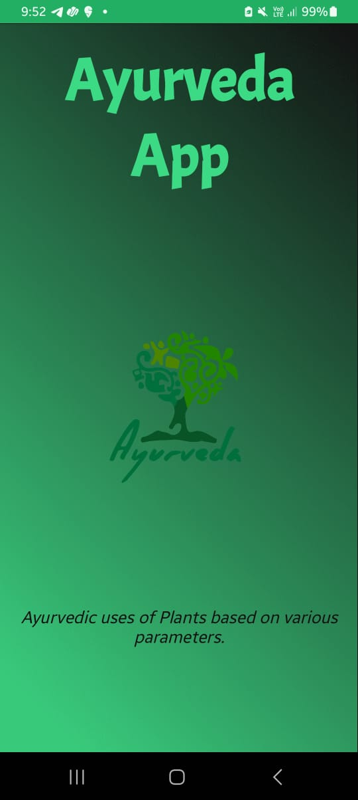
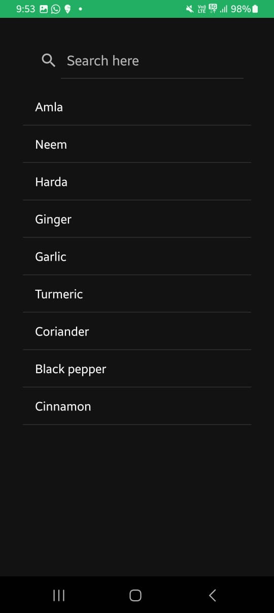
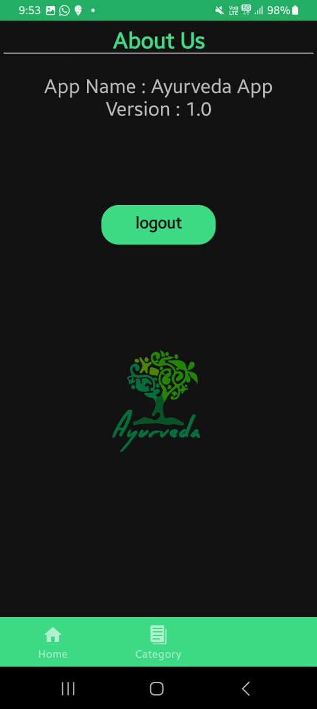

# ⚡ Ayurveda Android Application
## Health_comes_First
### Kindly Star this Repository ⚡
## Mail to : suriyaa2002@gmail.com for access to Full Project Code.

Welcome to our Ayurveda Android Application repository! This application is designed to provide users with a comprehensive guide to Ayurveda, including yoga exercises, information on Ayurvedic medicines, and more.

### Screenshots
Landing Page | Home | Categories
:------------------:|:-------------------:|:-------------------:
 |  |  

Sub Category | Info | About us
:------------------:|:-------------------:|:-------------------:
 |  | 

### Key Features
1) Yoga Exercises: Explore a variety of yoga exercises tailored to different needs and skill levels.
2) Ayurvedic Medicines: Access detailed information about various Ayurvedic medicines and their uses.
3) Dosha Analysis: Learn about your Ayurvedic body constitution (dosha) and get personalized recommendations.
4) Remedies and Tips: Discover natural remedies and lifestyle tips for maintaining balance and well-being.
5) Search Functionality: Easily find specific yoga exercises, medicines, or topics of interest.
6) Bookmarking: Save your favorite exercises, medicines, or articles for quick access.

### Installation
To install the Ayurveda Android Application, follow these steps:
1. Clone this repository to your local machine using git clone command
2. Open the project in Android Studio.
3. Build and run the application on your Android device or emulator.

### Usage
Once the application is installed, you can start exploring its features:

1) Browse Content: Navigate through the different sections to explore yoga exercises, Ayurvedic medicines, dosha analysis, remedies, and tips.
2) Search: Use the search functionality to quickly find specific content.
3) Dosha Analysis: Take the dosha analysis quiz to understand your Ayurvedic body constitution.
4) Bookmark: Save your favorite content by bookmarking it for later reference.
5) Settings: Customize the app settings according to your preferences.

For any questions, feedback, or issues, please feel free to contact us.

